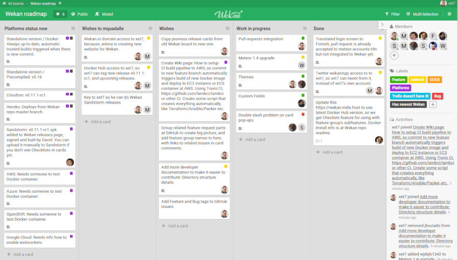

<!--
N.B.: This README was automatically generated by https://github.com/YunoHost/apps/tree/master/tools/README-generator
It shall NOT be edited by hand.
-->

# Wekan for YunoHost

[](https://dash.yunohost.org/appci/app/wekan)    
[](https://install-app.yunohost.org/?app=wekan)

*[Lire ce readme en français.](./README_fr.md)*

> *This package allows you to install Wekan quickly and simply on a YunoHost server.
If you don't have YunoHost, please consult [the guide](https://yunohost.org/#/install) to learn how to install it.*

## Overview

WeKan ® is an completely Open Source and Free software collaborative kanban board application with MIT license.


**Shipped version:** 6.42~ynh1


**Demo:** https://demo.sandstorm.io/appdemo/m86q05rdvj14yvn78ghaxynqz7u2svw6rnttptxx49g1785cdv1h

## Screenshots



## Disclaimers / important information

* There is currently **no SSO integration** though it might be integrated at some point in the app, now that it's supported in Meteor/Wekan. In the meantime, users can create accounts (in fact, they can create infinite number of accounts) manually, and need to login manually specifically in Wekan.
* This app **only works on x86, 64bits architecture**! In particular, it won't work on 32 bit machines or ARM. See the discussion [here](https://github.com/YunoHost-Apps/wekan_ynh/issues/1#issuecomment-401612500).
* YunoHost users with more than one email address can't login to wekan using ldap. For example first YunoHost user has severals email addresses: root@domain; admin@domain; webmaster@domain; postmaster@domain, etc... Workaround: remove all mail aliases of the user you want to connect, connect one time on wekan, recreate the aliases of the YunoHost user.

## Configuration:
As LDAP authentification is enabled by default, Wekan admins correspond to the permission `Wekan Admin`. The user you choose during installation is member of this group.
To add an admin account, you can:

- [with the webadmin] go to Users > Groups and permissions > Add the user to the permission `Wekan Admin`
- [or with the command line] `yunohost user permission update wekan.admin -a the_user_to_add`

All others YunhoHost user can access with LDAP authentication.

If you have disable ldap authentication, first registered user will be admin, and next ones normal users. If you want other admins too, you can change their permission to admin at Wekan Admin Panel.

**Private/Public mode:** In private mode, only authorized YunoHost members can access to the Wekan. 

## Documentation and resources

* Official app website: <https://wekan.github.io>
* Official admin documentation: <https://github.com/wekan/wekan/wiki>
* Upstream app code repository: <https://github.com/wekan/wekan>
* YunoHost documentation for this app: <https://yunohost.org/app_wekan>
* Report a bug: <https://github.com/YunoHost-Apps/wekan_ynh/issues>

## Developer info

Please send your pull request to the [testing branch](https://github.com/YunoHost-Apps/wekan_ynh/tree/testing).

To try the testing branch, please proceed like that.

``` bash
sudo yunohost app install https://github.com/YunoHost-Apps/wekan_ynh/tree/testing --debug
or
sudo yunohost app upgrade wekan -u https://github.com/YunoHost-Apps/wekan_ynh/tree/testing --debug
```

**More info regarding app packaging:** <https://yunohost.org/packaging_apps>
